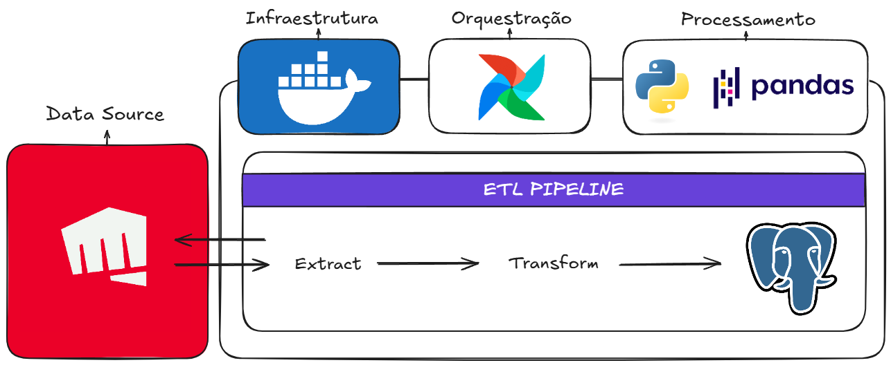

# 🎮 LoL Data Engineering Pipeline

## 📖 Visão geral
Pipeline de dados que realiza a extração de dados de partidas de jogadores específicos da API da Riot Games transforma os dados e os armazena de forma estruturada em um banco PostgreSQL.

O pipeline é orquestrado utilizando Docker + Apache Airflow, automatizando o fluxo completo de ETL.

## 🎯 Objetivo
Construir um pipline automatizado que seja capaz de:
- Extrair dados brutos da API da Riot Games
- Transformar e normalizar os dados
- Armazenar os dados processados em múltiplas tabelas relacionais
- Executar o fluxo de forma agendada e orquestrada

## 🏗 Arquitetura do Pipeline


## 🛠 Tecnologias Utilizadas
- Python
- Pandas
- PostgreSQL
- Docker Apache Airflow
- API da Riot Games 

## 📂 Estrutura do projeto
```
├── dags/
│   └── lol_dag.py
├── src/
│   ├── extract_mastery_data.py
│   ├── extract_match_data.py
│   ├── load_data.py
│   └── transform_data.py
├── .gitignore
├── README.md
├── docker-compose.yml
├── pyproject.toml
└── uv.lock
```